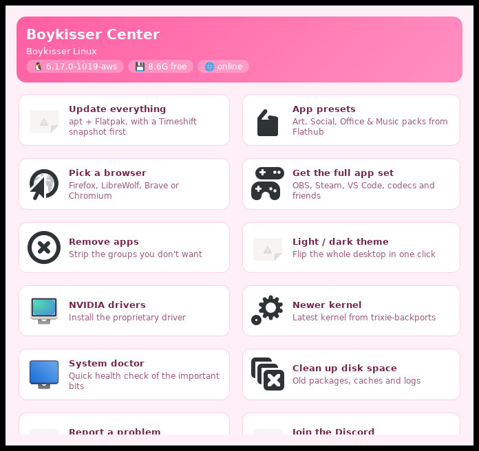

# Installing boykisser-tools

The scripts and apps that ship with Boykisser Linux are maintained in a
separate repo: [boykisser-tools](https://github.com/taynotfound/boykisser-tools).
They get baked into the ISO automatically at build time, but you can also
install or update them manually on any Debian-based system.



---

## Full install

Download all the `.deb` files from the
[latest release](https://github.com/taynotfound/boykisser-tools/releases/latest)
and install in one shot:

```sh
# download all debs into a temp folder
mkdir -p /tmp/bk-tools && cd /tmp/bk-tools
gh release download --repo taynotfound/boykisser-tools --pattern "*.deb"

# install (apt resolves missing deps automatically)
sudo dpkg -i *.deb
sudo apt-get install -f
```

Or if you just want the lazy one-liner and have `curl`:

```sh
curl -s https://api.github.com/repos/taynotfound/boykisser-tools/releases/latest \
  | grep browser_download_url | grep '\.deb' | cut -d'"' -f4 \
  | xargs -I{} curl -LO {}
sudo dpkg -i *.deb && sudo apt-get install -f
```

---

## Individual packages

You don't have to install everything. Each part ships as its own `.deb`:

| Package | What it gives you |
|---|---|
| `boykisser-core` | The `boykisser` CLI dispatcher |
| `boykisser-center` | Graphical control center (GTK3) |
| `boykisser-update` | `boykisser update` - apt + flatpak + self-update |
| `boykisser-doctor` | `boykisser doctor` - system health check |
| `boykisser-nvidia` | `boykisser nvidia` - NVIDIA driver installer |
| `boykisser-theme` | `boykisser theme` - light/dark theme switcher |
| `boykisser-apps` | App installer tools (OBS, Steam, VS Code, presets, browser picker, debloat) |
| `boykisser-system` | System tools (cleanup, kernel, autologin, wallpaper, report, welcome) |
| `boykisser-tools` | Meta-package - installs all of the above |

Example - just want the updater and doctor on a minimal system:

```sh
sudo dpkg -i boykisser-update_*.deb boykisser-doctor_*.deb
sudo apt-get install -f
```

---

## Updating

If you already have `boykisser-update` installed, it handles itself:

```sh
boykisser update
```

That checks GitHub releases, downloads a newer `.deb` if one exists, and
installs it. No PPA, no sources.list entry needed.

---

## Building from source

```sh
git clone https://github.com/taynotfound/boykisser-tools
cd boykisser-tools
sudo gem install fpm --no-document
chmod +x bin/boykisser*
fpm -s dir -t deb -n boykisser-tools -v dev bin/=/usr/local/bin/
sudo dpkg -i boykisser-tools_dev_amd64.deb
```

---

## Uninstalling

```sh
sudo apt-get remove boykisser-tools boykisser-core boykisser-center \
  boykisser-update boykisser-doctor boykisser-nvidia boykisser-theme \
  boykisser-apps boykisser-system
```

---

## See also

- [The boykisser CLI](#boykisser-cli)
- [First steps after install](#after-install)
- [Presets & apps](#presets-and-apps)
