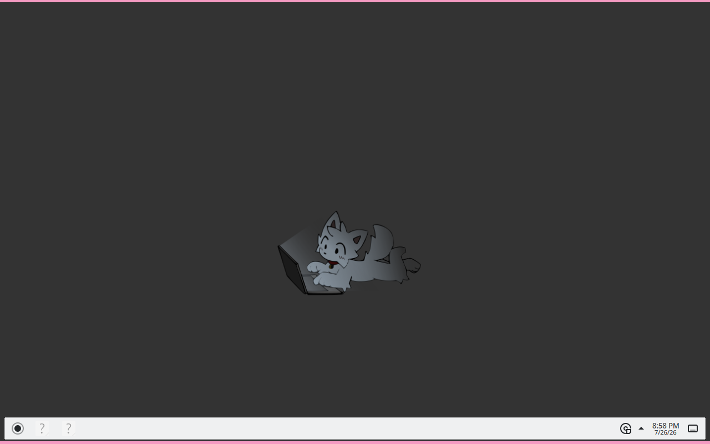

# Theming & customization

Boykisser Linux ships pink. Bright, unapologetic, deeply pink. You *can* change it  -  this is Linux, you can change literally everything  -  but consider why you would.

That said, here's how to make it yours.




---

## Quick toggles

### Light / dark mode

```bash
boykisser theme
```

Toggles between the light and dark variants of the default theme. Both are pink. One is a lighter pink. Run it again to switch back. It applies to GTK apps, the panel, and the window decorations.

### Wallpapers

```bash
boykisser wallpaper
```

Cycles through the 6 wallpapers that ship with the ISO:

| Name | Vibe |
|------|------|
| `kisser-default` | The classic. Pink gradient, mascot in the corner |
| `kisser-night` | Dark purple/pink, stars |
| `kisser-minimal` | Solid blush pink, no mascot (for the tasteful) |
| `kisser-forest` | Green with pink accents  -  the most chaotic option |
| `kisser-city` | Lo-fi city skyline, pink sunset |
| `kisser-abstract` | Geometric, very 2024 |

You can also right-click the desktop → **Desktop Settings** → pick any image you want. `boykisser wallpaper` just makes cycling faster.

---

## GTK theme (the window chrome and widgets)

Boykisser ships with its own GTK theme. To try others:

1. Install a theme  -  [gnome-look.org](https://www.gnome-look.org/browse?cat=135) is the main source, or:
   ```bash
   sudo apt install arc-theme materia-gtk-theme
   ```

2. Open **Appearance** from the app menu → **Style** tab → pick your theme

3. While you're there, the **Icons** tab lets you change icon packs.

Some popular icon packs:
```bash
sudo apt install papirus-icon-theme
# or via Flatpak:
flatpak install flathub org.gnome.icons.Adwaita
```

> The default icon pack is a customized Papirus with pink folder colors. If you install stock Papirus you lose the pink folders. Just saying.

---

## XFCE panel tweaks

Right-click the panel → **Panel** → **Panel Preferences**. From here you can:

- Drag the panel to any edge of the screen
- Change the height/width
- Add, remove, or reorder panel plugins (clock, workspace switcher, system tray, etc.)

Right-click any plugin on the panel → **Properties** to configure that specific item.

To add a new plugin: Panel Preferences → **Items** tab → the `+` button at the bottom.

---

## Plank dock (if you want one)

Plank is a macOS-style dock. It's not installed by default because the panel already works fine, but if you want it:

```bash
sudo apt install plank
plank &
```

Right-click the dock → **Preferences** to configure it. To autostart it, add it to **Session and Startup** → **Application Autostart**.

To theme it, drop a theme folder into `~/.local/share/plank/themes/`. [pling.com](https://www.pling.com/s/XFCE/browse?cat=473) has a pile of them.

---

<details>
<summary>⚙️ Kvantum  -  theming Qt apps (advanced)</summary>

Some apps (like VLC, qBittorrent, KDE apps) use Qt instead of GTK. GTK themes don't affect them, so they can look out of place. Kvantum fixes that.

**Install:**
```bash
sudo apt install qt5-style-kvantum qt5-style-kvantum-themes
```

**Set it as the Qt style:**
```bash
kvantummanager
```

In Kvantum Manager: **Change/Delete Theme** → pick one → **Use this theme**.

Then make Qt apps actually use it:
```bash
echo "QT_STYLE_OVERRIDE=kvantum" >> ~/.profile
```

Log out and back in. Qt apps will now use the Kvantum theme.

For a matching look, the Kvantum theme that goes with Materia GTK is called `Materia`, and for Arc it's `Arc`. Most popular GTK themes have a matching Kvantum variant  -  search the theme name + "kvantum" on gnome-look.

</details>

<details>
<summary>⚙️ Conky  -  desktop info overlay (advanced)</summary>

Conky draws system stats directly on the desktop. CPU usage, RAM, disk, network, time  -  all floating on your wallpaper like a hacker movie prop.

**Install:**
```bash
sudo apt install conky-all
```

**Start it:**
```bash
conky &
```

Default config lives at `~/.config/conky/conky.conf` (created on first run). Here's a minimal config to get you started with pink text:

```lua
conky.config = {
    update_interval = 2,
    background = false,
    double_buffer = true,
    alignment = 'top_right',
    gap_x = 20,
    gap_y = 40,
    own_window = true,
    own_window_type = 'desktop',
    own_window_transparent = true,
    font = 'JetBrains Mono:size=10',
    default_color = 'ff69b4',   -- hot pink
    use_xft = true,
};

conky.text = [[
${time %H:%M:%S}
CPU: ${cpu}%
RAM: $mem / $memmax
Disk: ${fs_used /} / ${fs_size /}
]];
```

To autostart: **Session and Startup** → **Application Autostart** → add `conky`.

There are hundreds of pre-made conky configs on [deviantart.com](https://www.deviantart.com/search?q=conky+config) and [pling.com](https://www.pling.com). Most are just a config file  -  drop it in `~/.config/conky/conky.conf` and restart conky.

</details>

---

## Going full custom vs. just tweaking

Two valid paths:

**Just tweaking (recommended):** Run `boykisser theme` to switch light/dark, swap the wallpaper, maybe change the icon pack. Takes 5 minutes, looks great, you keep the stuff that already works.

**Going full custom:** Replace the GTK theme, set up Kvantum for Qt, configure Plank, get a conky overlay, change the panel layout, custom fonts. Takes an afternoon. Looks exactly how you want. Nothing will break as long as you're just changing themes  -  these are all cosmetic, not system-level changes.

Either way, if you somehow make it look worse and want to go back:
```bash
boykisser theme reset
```

Restores the default Boykisser theme. Clean slate.

---

One last thing: you *can* make this look like Windows. Or macOS. Or like it's 2003 again. Linux has been doing this for decades. But none of those distros ship with a kissing cat mascot, so consider that before you paint over it.

---

## See also

- [First steps after install](#after-install)
- [Presets & apps](#presets-and-apps)
- [The boykisser CLI](#boykisser-cli)
